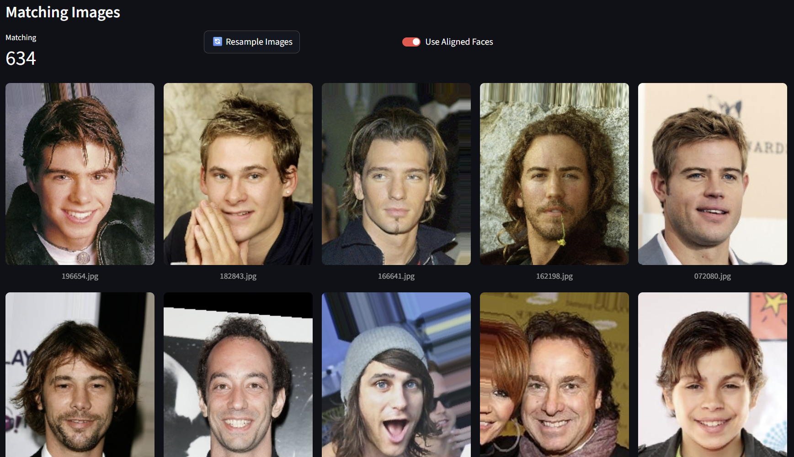
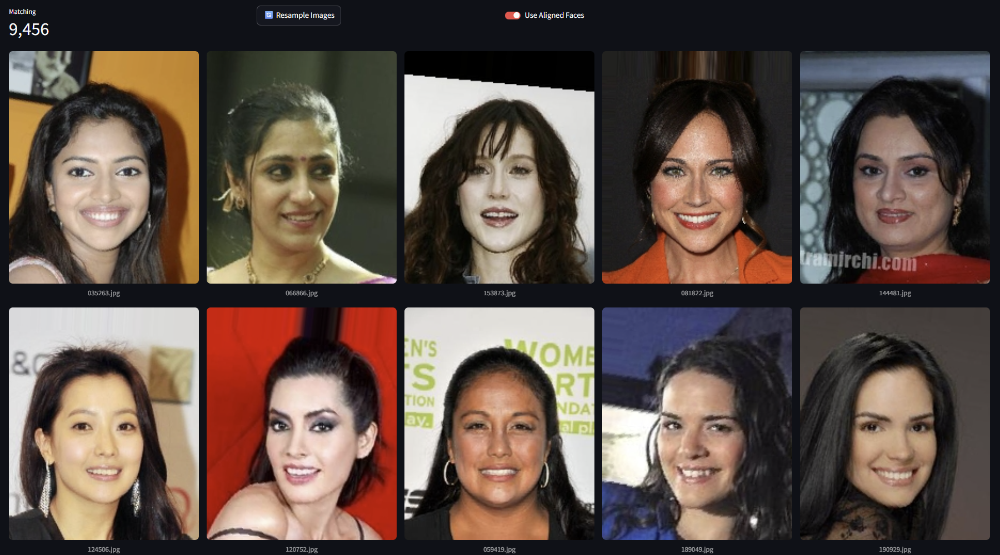
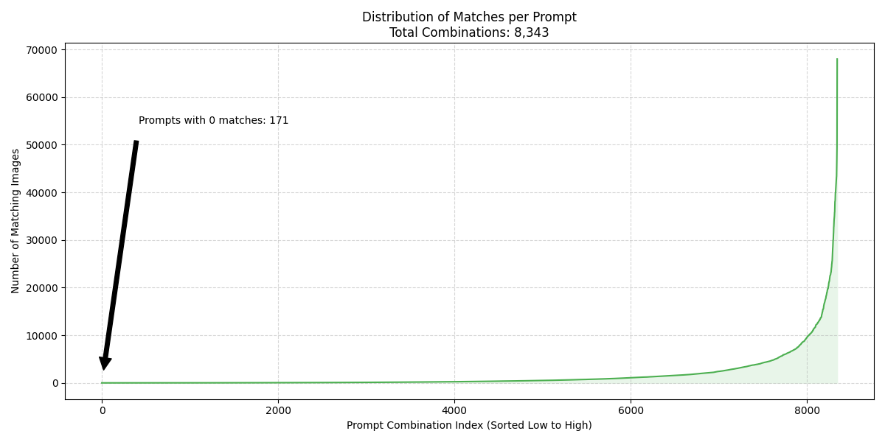

# Stable Diffusion 3.5 Fine-Tuning on CelebA

## Project Overview
This project aims to fine-tune Stable Diffusion 3.5 (SD 3.5) on the CelebA dataset to generate highly realistic, diverse portrait images. I have established a comprehensive pipeline for model evaluation, data exploration, and automated prompt engineering to ensure high-quality training data.

---

## Baseline Model Comparison
Before fine-tuning, I evaluated the three available SD 3.5 variants (Large, Medium, and Turbo) using a custom comparison dashboard.

**Observations:**
*   **Large & Medium:** Demonstrate promising prompt adherence and general quality, though they still exhibit typical "AI-generated" artifacts (smoothing, artificial lighting).
*   **Turbo:** Lacks photorealism, often producing cartoon-like textures and failing to capture subtle facial features required for this dataset.

(See examples below)

---

## Prompt Generation Strategy
To map CelebA’s binary attributes to natural language prompts, I developed a **Unified Bucket Structure**. 

This approach distributes all attributes across 8 semantic buckets (e.g., Hair Structure, Nose, Eyebrows, ..., Other). 
This enforces **mutual exclusion**, preventing logical contradictions such as "Black hair" and "Blond hair" appearing in the same prompt.

For full implementation details, see: [`src/prompt_generator/Dataset_Analysis.md`](src/prompt_generator/Dataset_Analysis.md).

**Dashboard & Validation**

I built a dashboard to visualize how these generated prompts map to real images in the dataset. 
This allows me to verify that a generated prompt like *"A realistic portrait of a man, with brown 
hair, full lips, and bags under the eyes"* corresponds to accurate ground-truth images.

## Examples (before fine-tuning)
[vanilla Stable Diffusion 3.5]
### "A realistic portrait of a man, with brown hair, full lips, and bags under the eyes"

### "A photorealistic portrait of a woman, with black hair, slightly parted lips, and a smile."

Find more examples [here](https://github.com/M4GI3R/stable-diffusion-3.5-celeba-finetuning/tree/master/comparison_SD35_celebA_examples).

---

## Dataset Analysis & Filtering Proposal
I generated every possible prompt combination (8,343 total) allowed by the bucket logic and cross-referenced them against the 200,000+ CelebA images to check for data availability.

### Distribution Analysis
As shown in the histogram below, there is a "long tail" of prompt combinations that appear very rarely in the dataset. Rare combinations often indicate conflicting attributes, labeling errors in the original dataset, or extremely obscure features that may confuse the model during training.

### Proposed Filtering Strategy
To ensure the fine-tuning process relies on robust, correctly labeled data, I propose a filtering threshold to exclude rare or potentially mislabeled combinations:

*   **Total Possible Combinations:** 8,343
*   **Threshold:** Only use prompts with **≥ 200 matching images**.
*   **Removed:** ~3,723 combinations (obscure/noisy data).
*   **Retained:** ~4,620 high-quality combinations.

This strategy ensures that every text prompt used for training is backed by a sufficient volume of ground-truth visual data.